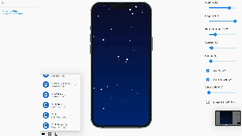

# SnowingWidget
Snowing Widget to animate backgrounds in Flutter



# How to use it ?
```@dart
import 'package:flutter/material.dart';
import 'package:snow_widget/widget/snow_widget.dart';

class SnowingApp extends StatelessWidget {
  const SnowingApp({super.key});

  @override
  Widget build(BuildContext context) {
    return Scaffold(
      body: Container(
        width: MediaQuery.of(context).size.width,
        height: MediaQuery.of(context).size.height,
        decoration: const BoxDecoration(
          gradient: LinearGradient(
            colors: [
              Color(0xFF002C7E),
              Color(0xFF0D0C2F),
            ],
            begin: Alignment.topLeft,
            end: Alignment.bottomRight,
          ),
        ),
        child: const Stack(
          children: <Widget>[
            Positioned.fill(
              child: SnowWidget(
                isRunning: true,
                totalSnow: 50,
                speed: 0.2,
                maxRadius: 8,
                snowColor: Colors.white,
              ),
            ),
          ],
        ),
      ),
    );
  }
}

```